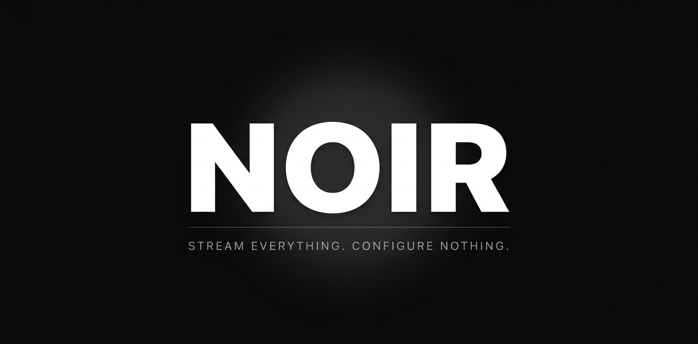
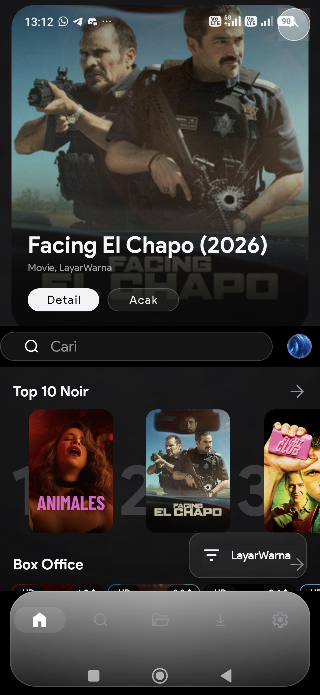
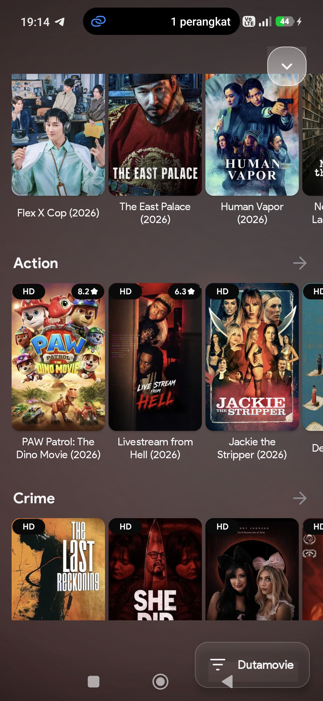

<p align="center">
  
</p>

<p align="center">
  <a href="https://github.com/michat88/Noir/releases"></a>
  <a href="https://github.com/michat88/Noir/releases"></a>
  
  
  <a href="LICENSE"></a>
</p>

<p align="center">
  <a href="https://github.com/michat88/Noir/stargazers"></a>
  <a href="https://saweria.co/michat88"></a>
  <a href="https://t.me/michat88"></a>
</p>

<p align="center"><strong>Stream everything. Configure nothing.</strong><br>
Aplikasi streaming Android berbasis CloudStream dengan konfigurasi nol:
sumber konten, ekstensi, dan subtitle siap sejak pemasangan pertama.</p>

---

## Daftar Isi

- [Tentang](#tentang)
- [Fitur Unggulan](#fitur-unggulan)
- [Tangkapan Layar](#tangkapan-layar)
- [Instalasi](#instalasi)
- [Build dari Sumber](#build-dari-sumber)
- [Konten Dewasa](#konten-dewasa)
- [Jaringan dan Privasi](#jaringan-dan-privasi)
- [Dukungan](#dukungan)
- [Disclaimer](#disclaimer)
- [Kredit](#kredit)
- [Lisensi](#lisensi)

---

## Tentang

**Noir** adalah aplikasi streaming untuk Android yang dibangun di atas
[CloudStream](https://github.com/recloudstream/cloudstream). Proyek ini
dirancang dengan satu prinsip: **langsung pakai**. Tidak ada pengaturan
repositori manual, tidak ada langkah aktivasi rumit — sumber tontonan,
ekstensi, dan penyedia subtitle telah terkurasi dan aktif sejak aplikasi
pertama kali dibuka.

Noir dikembangkan khusus untuk penonton di Indonesia: prioritas pada sumber
konten berbahasa Indonesia dan bersubtitle Indonesia, antarmuka yang ringkas
untuk pengguna awam, serta jalur jaringan yang tahan terhadap pemblokiran ISP.

## Fitur Unggulan

### Antarmuka sinematik

- **Hero banner** bergaya layanan streaming besar dengan poster unggulan,
  aksi cepat, dan indikator progres tontonan.
- **Aura dinamis** — warna latar diekstrak langsung dari poster yang sedang
  tampil dan bergerak halus di belakang seluruh konten.
- **Liquid glass** — pill pencarian, dock navigasi, dan panel memakai resep
  kaca translusen ala sistem operasi modern.
- **Dock adaptif** yang menyelam saat Anda scroll ke bawah dan kembali saat
  Anda scroll ke atas, memberi ruang penuh untuk konten.
- **Tema** bawaan *Monochrome Noir* beserta beberapa varian; ketebalan kaca,
  blur, dan animasi dapat diatur, termasuk sakelar utama untuk mematikan
  seluruh animasi.

### Mesin pencarian

- Pencarian mendalam lintas penyedia dengan peringkat relevansi,
  deduplikasi hasil, dan cache cerdas agar hasil selalu instan dan konsisten.
- Halaman pencarian dan beranda memakai perilaku serta tampilan yang sama.

### NoirSync — subtitle

- Multi-sumber subtitle (termasuk SubSource dan iSubtitles) dengan prioritas
  bahasa Indonesia.
- Pengaturan subtitle lengkap langsung di dalam pemutar: gaya, ukuran, posisi,
  dan offset waktu yang diterapkan **live** tanpa mengulang pemutaran.

### NoirSound — mesin audio

- Peningkatan audio bawaan (EQ, kompresi dinamis, dan normalisasi loudness)
  yang diproses di dalam aplikasi sehingga aman untuk speaker perangkat.
- Nonaktif secara bawaan; aktifkan dari pengaturan pemutar bila diinginkan.
- Ident pembuka audio-spasial asli Noir.

### Ekstensi dan repositori

- Belasan repositori terkurasi terpasang bawaan, termasuk sumber Indonesia
  (Idlix, LayarWarna, Dutamovie, dan lainnya) serta sumber anime dan
  internasional.
- Pembaruan ekstensi otomatis dari GitHub tanpa membangun ulang aplikasi.
- Dukungan repositori komunitas; templat repositori tersedia di
  [`NOIR-repo-template`](NOIR-repo-template) bagi pengembang yang ingin
  menerbitkan sumber sendiri.

## Tangkapan Layar

<p align="center">
  
  &nbsp;
  
</p>

## Instalasi

1. Unduh APK terbaru dari halaman [Releases](https://github.com/michat88/Noir/releases).
2. Buka berkas APK di perangkat Android Anda.
3. Izinkan instalasi dari *sumber tidak dikenal* bila diminta.
4. Jalankan Noir. Inisialisasi berjalan otomatis — tidak ada konfigurasi lanjutan.

## Build dari Sumber

### Google Colab (tanpa PC)

Repositori menyertakan [`NOIR-Build-APK.ipynb`](NOIR-Build-APK.ipynb) yang
membangun APK langsung di Google Colab:

1. Unggah `Noir-source.zip` dari halaman Releases ke sesi Colab Anda.
2. Buka notebook dan jalankan seluruh sel secara berurutan.
3. Unduh APK hasil build dari panel berkas Colab.

### Baris perintah

```bash
git clone https://github.com/michat88/Noir.git
cd Noir
./gradlew assembleStableDebug
```

Membutuhkan JDK 17 dan Android SDK dengan Build-Tools 36. Untuk panduan build
di perangkat Android tanpa komputer, lihat [`BUILD-DI-HP.md`](BUILD-DI-HP.md).

## Konten Dewasa

Konten dewasa **nonaktif secara bawaan** dan hanya tampil melalui opt-in
eksplisit:

1. Buka **Pengaturan > Penyedia**, aktifkan opsi NSFW pada ekstensi yang
   mendukungnya.
2. Pada **Media yang lebih diinginkan**, centang kategori NSFW.
3. Kembali ke beranda dan aktifkan filter NSFW pada baris kategori.

Gunakan secara bijak. Sebagian konten mungkin tidak sesuai untuk pengguna di
bawah umur.

## Jaringan dan Privasi

Noir tidak menyimpan dan tidak menghosting berkas media apa pun; aplikasi
berfungsi sebagai pencari dan pemutar konten yang tersedia publik di internet.
Untuk menjaga koneksi tetap stabil terhadap pemblokiran ISP, aktifkan
**DNS over HTTPS** melalui **Pengaturan > Umum**.

## Dukungan

- [Saweria](https://saweria.co/michat88) — traktir kopi pengembang.
- [Telegram](https://t.me/michat88) — kanal rilis dan kontak.
- Di dalam aplikasi: menu dukungan pada pengaturan umum.

## Disclaimer

Noir adalah alat pengindeks (scraper) atas halaman web publik. Seluruh konten
video berada di pihak ketiga; tidak ada berkas media yang disimpan atau
dihosting oleh aplikasi ini maupun oleh proyek CloudStream. Tanggung jawab
atas penggunaan berada pada pengguna akhir.

## Kredit

Noir adalah modifikasi yang dibangun di atas fondasi
[CloudStream](https://github.com/recloudstream/cloudstream). Seluruh mesin
inti — pemutar, sistem ekstensi, dan arsitektur aplikasi — adalah karya tim
CloudStream; terima kasih atas kontribusi luar biasanya kepada komunitas
open-source.

## Lisensi

Proyek ini dilisensikan di bawah [GPL-3.0](LICENSE).

---

<p align="center">
  Noir — dibangun untuk penikmat film di Indonesia.
</p>
